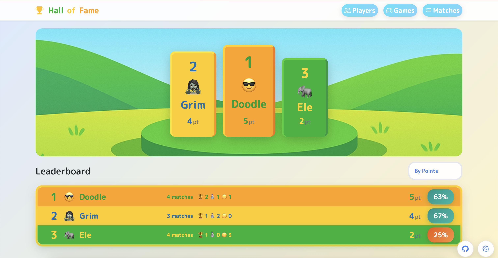
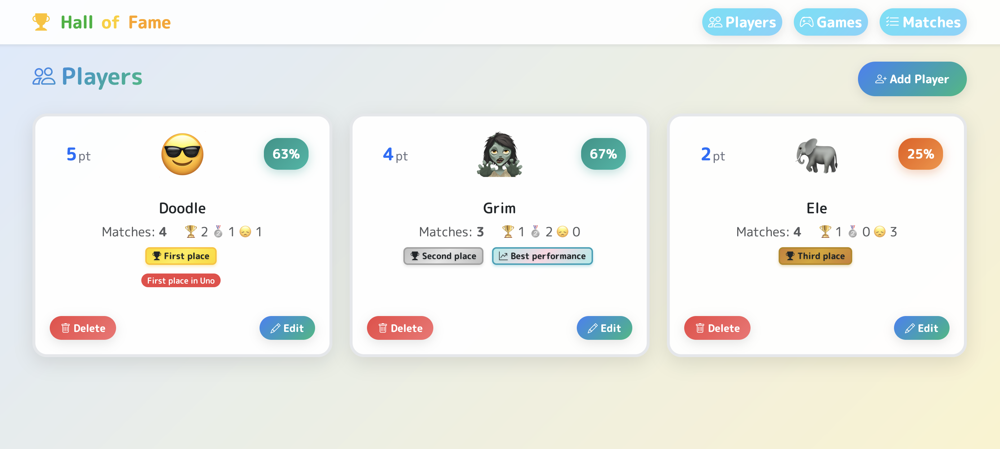
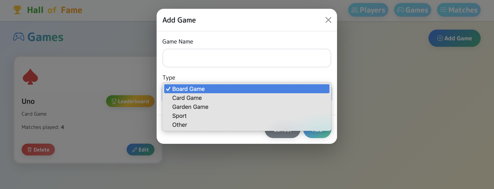
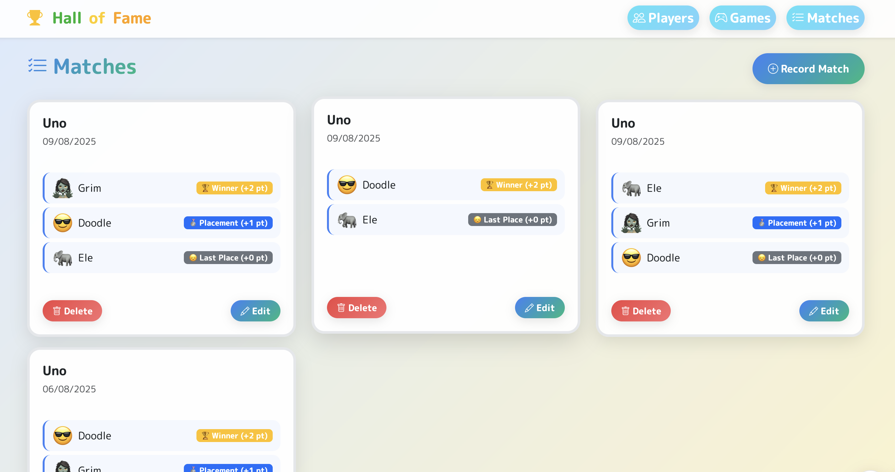
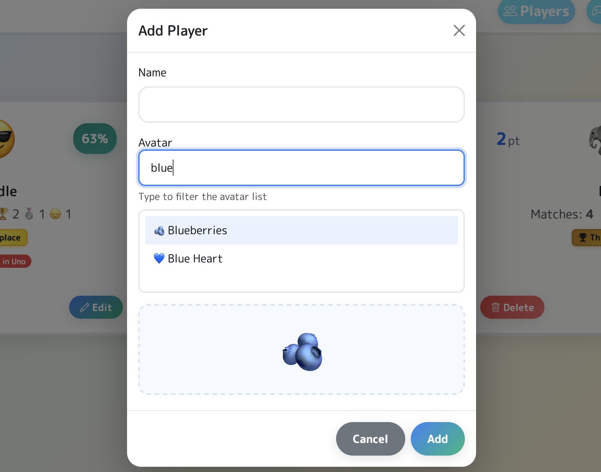

# Hall of Fame - Family Games Leaderboard 🏆

A web application for managing family games leaderboards with scoring system, statistics, and data backup.

**Available Languages:** 🇮🇹 Italian | 🇺🇸 English

## 🚀 Key Features

- **Player Management**: Add, edit, and delete players with custom avatars
- **Game Catalog**: Organize games by type (board, card, garden, sport)
- **Match Recording**: Scoring system with positions (Winner: 2pt, Placement: 1pt, Last: 0pt)
- **Dynamic Leaderboard**: Podium and complete ranking with performance calculation
- **Backup/Restore**: Export and import data in .hof format
- **Multi-Language Support**: 🇮🇹 Italian and 🇺🇸 English interfaces
- **Responsive Design**: Modern and mobile-friendly interface

## 📸 Screenshots

### 🏆 Leaderboard & Podium

*Dynamic leaderboard with podium display and performance statistics*

### 👥 Player Management

*Player list with custom avatars and statistics*

### 🎮 Game Management

*Adding new games with type categorization*

### 🎯 Match Recording

*Recording match results with participant selection*

### 👤 Adding Players

*Creating new players with emoji avatar selection*

## 📁 Project Structure

```
halloffame/
├── index.html                 # Main user interface
├── constants-it.js            # 🇮🇹 Italian constants and configurations
├── constants-en.js            # 🇺🇸 English constants and configurations
├── text-manager.js            # Multi-language text management system
├── utils.js                   # Utility functions and validations
├── modal-manager.js           # Standardized modal management
├── html-builder.js            # Reusable HTML generation
├── display-manager.js         # Common display patterns
├── managers/                  # 📁 Specialized managers (modular architecture)
│   ├── storage-manager.js     # 🆕 Centralized localStorage management
│   ├── navigation-manager.js  # 🆕 Section navigation with callbacks
│   ├── backup-manager.js      # 🆕 Advanced data import/export
│   ├── avatar-manager.js      # 🆕 Avatar system and filters
│   ├── player-manager.js      # 🆕 Player CRUD and statistics
│   ├── stats-manager.js       # 🆕 Ranking and podium calculations
│   ├── game-manager.js        # 🆕 Game CRUD and statistics
│   └── match-manager.js       # 🆕 Match CRUD and participants
├── app.js                     # Main controller (manager architecture)
├── app-bridge.js              # Global functions and initialization
├── validate-compliance.js     # Automatic compliance validation script
├── styles.css                 # Consolidated CSS styles
├── README.md                  # Project documentation
├── CODE_INSTRUCTIONS.md       # Detailed technical instructions
├── AI-README.md               # Automatic setup for AI assistant
├── .ai-development-rules.md   # Mandatory rules for AI development
└── .gitignore                 # Files to exclude from versioning
```

## 🏗️ Code Architecture

### **Multi-Language Architecture:**
```javascript
constants-it.js/constants-en.js → text-manager.js → utils.js → modal-manager.js → 
html-builder.js → display-manager.js → storage-manager.js → navigation-manager.js → 
backup-manager.js → avatar-manager.js → player-manager.js → stats-manager.js → 
app.js → app-bridge.js
```

**Multi-Language System:**
- **`constants-it.js`**: 🇮🇹 Italian text constants and configurations
- **`constants-en.js`**: 🇺🇸 English text constants and configurations  
- **`text-manager.js`**: Dynamic language switching and text management
- **`managers/language-manager.js`**: Language selection and initialization

**Specialized Managers (New Architecture - `/managers/`):**
- **`managers/storage-manager.js`**: Centralized and secure localStorage management
- **`managers/navigation-manager.js`**: Section navigation with callback system
- **`managers/backup-manager.js`**: Advanced import/export with data validation
- **`managers/avatar-manager.js`**: Avatar system, dynamic filters, preview
- **`managers/player-manager.js`**: Player CRUD, statistics, validations
- **`managers/stats-manager.js`**: Ranking calculations, performance, dynamic podium
- **`managers/game-manager.js`**: Game CRUD, statistics, types
- **`managers/match-manager.js`**: Match CRUD, participants, sorting

**Base Modules (Unchanged):**
- **`constants-it.js/constants-en.js`**: Central configurations and messages
- **`text-manager.js`**: Multi-language text management system
- **`utils.js`**: Utility functions (validations, modals)
- **`modal-manager.js`**: Unified add/edit modal management
- **`html-builder.js`**: Standardized HTML generation
- **`display-manager.js`**: Common display patterns
- **`app.js`**: **Main controller** that coordinates managers
- **`app-bridge.js`**: Global functions and app initialization

### **🏆 Benefits of the New Architecture:**
- ✅ **Separation of Concerns**: Each manager has specific responsibilities
- ✅ **Multi-Language Support**: Dynamic language switching with fallbacks
- ✅ **Testability**: Individual managers completely testable
- ✅ **Maintainability**: Isolated changes without cross-impact
- ✅ **Scalability**: Easy to add new managers or features
- ✅ **Reusability**: Managers usable in other contexts
- ✅ **Performance**: Optimized loading and memory management
- ✅ **Debugging**: Errors localized in specific managers

## 🤖 Automatic AI Compliance System

This project includes an **advanced automatic compliance system** that ensures any AI assistant automatically follows architectural rules without manual intervention.

### **AI Configuration Files:**
```
.ai-context.md              # Immediate context for AI (mandatory reading)
.ai-development-rules.md     # Complete non-negotiable rules
.ai-assistant-config.json    # Machine-readable configuration
.cursor-rules               # Specific rules for Cursor AI
validate-compliance.js      # Automatic validation script
AI-README.md                # Complete AI setup guide
```

### **Benefits for AI Assistant:**
- ✅ **Automatic compliance** without manual instructions
- ✅ **Zero duplications** guaranteed by architecture
- ✅ **Pattern enforcement** automatic
- ✅ **Real-time validation** of code
- ✅ **Self-enforcing rules** for any AI

### **Validation Commands:**
```bash
npm run validate          # Complete compliance validation
npm run check-compliance  # Quick check + confirmation
npm run start            # Validation + server start
```

## 🚀 Quick Start

### **Prerequisites**
- Modern browser (Chrome, Firefox, Safari, Edge)
- Node.js 14+ (for compliance validation)
- Local web server (optional for development)

### **Installation**
```bash
# Clone the repository
git clone https://github.com/rik72/hall-of-fame.git

# Enter the directory
cd hall-of-fame

# Install dependencies (optional, for validation)
npm install

# Start with automatic validation
npm start

# Or just the web server
python3 -m http.server 8088
```

### **Usage**
1. Open `index.html` in browser or go to `http://localhost:8088`
2. Add players from the "Players" section
3. Add games from the "Games" section
4. Record matches from the "Matches" section
5. View the leaderboard in the "Podium"

### **Language Selection**
- The application automatically detects your browser language
- You can manually switch between 🇮🇹 Italian and 🇺🇸 English
- Language preference is saved in your browser

## 💾 Backup System

### **Export**
- Click on "Backup" → "Export Backup"
- A `.hof` file is created with all data
- The file contains: players, games, matches + metadata

### **Import**
- Click on "Backup" → "Import Backup"
- Select a previously exported `.hof` file
- Confirm replacement of current data

## 🛠️ Development

### **For Developers**
1. **Read** `CODE_INSTRUCTIONS.md` for complete architecture
2. **Follow** `.ai-development-rules.md` for development standards
3. **Always use** existing utility modules (zero duplications!)
4. **Test** changes with `npm run validate`

### **For AI Assistant**
1. **Automatically read** `.ai-context.md` on first access
2. **Load configuration** from `.ai-assistant-config.json`
3. **Apply rules** from `.ai-development-rules.md`
4. **Always validate** with `validate-compliance.js`

### **Adding New Features**
```javascript
// 1. Add configurations in constants-it.js and constants-en.js
CONSTANTS.MESSAGES.NEW_FEATURE = 'Message for new feature';

// 2. Use existing utility modules
Utils.validateName(name, items, id, 'entity');           // from utils.js
ModalManager.setupModal('entity', false);                // from modal-manager.js
HtmlBuilder.createButton('Action', 'btn-primary', callback); // from html-builder.js

// 3. Follow consolidated patterns
DisplayManager.renderEmptyState(container, message);     // from display-manager.js

// 4. Validate compliance
npm run validate
```

### **Technologies Used**
- **Frontend**: Vanilla JavaScript ES6+, HTML5, CSS3
- **CSS Framework**: Bootstrap 5.3.3
- **Icons**: Bootstrap Icons 1.11.3
- **Backup**: JSZip 3.10.1
- **Storage**: LocalStorage API
- **Multi-Language**: Dynamic text management system
- **Compliance**: Node.js for automatic validation

## 📊 Scoring System

### **Positions and Points**
- 🏆 **Winner**: 2 points
- 🥈 **Placement**: 1 point  
- 😞 **Last place**: 0 points

### **Performance**
Calculated as percentage of points earned vs maximum possible:
```
Performance = (Total Points / (Matches × 2)) × 100
```

### **Ranking**
- **Primary sorting**: Total points
- **Secondary sorting**: Number of wins
- **Tertiary sorting**: Matches played (fewer = better)

## 🎨 Customization

### **Player Avatars**
- Over 400 emojis available
- Category-based search filter
- Real-time preview
- Skin tone emoji support

### **Themes and Styles**
- Customizable background gradient
- Smooth and modern animations
- Mobile-first responsive design
- Dark/Light mode ready (CSS variables)

## 🤝 Contributing

### **How to Contribute**
1. **Fork** the repository
2. **Create** feature branch: `git checkout -b feature/new-feature`
3. **Follow** rules in `.ai-development-rules.md`
4. **Test** changes with `npm run validate`
5. **Commit** with descriptive messages
6. **Push** and create Pull Request

### **Quality Standards**
- ✅ Zero code duplications
- ✅ Mandatory use of utility modules
- ✅ Centralized messages in constants-it.js and constants-en.js
- ✅ Respect for modular architecture
- ✅ Automatic compliance validation

## 📈 Roadmap

### **Current Version: 1.0** ✅
- [x] Complete player, game, match management
- [x] Leaderboard and statistics system
- [x] Complete backup/restore
- [x] Modular architecture
- [x] Automatic AI compliance system
- [x] Multi-language support (🇮🇹 Italian, 🇺🇸 English)
- [x] Complete documentation

### **Version 1.1** 🔄
- [ ] Advanced statistics charts
- [ ] Complete offline mode

### **Version 2.0** 📋
- [ ] Optional cloud sync
- [ ] Progressive Web App
- [ ] Additional languages (🇪🇸 Spanish, 🇫🇷 French, etc.)

## 📄 License

This project is released under MIT license. See the `LICENSE` file for details.

## 🙏 Acknowledgments

- **Bootstrap Team** for the CSS framework
- **JSZip** for compressed file management
- **Emojipedia** for emoji documentation
- **GitHub Community** for feedback and contributions

---

## 📞 Support

- **Issues**: [GitHub Issues](https://github.com/rik72/hall-of-fame/issues)
- **Documentation**: `CODE_INSTRUCTIONS.md`
- **AI Rules**: `.ai-development-rules.md`
- **AI Setup**: `AI-README.md`

**Developed with ❤️ for family gaming fun! 🎮** 